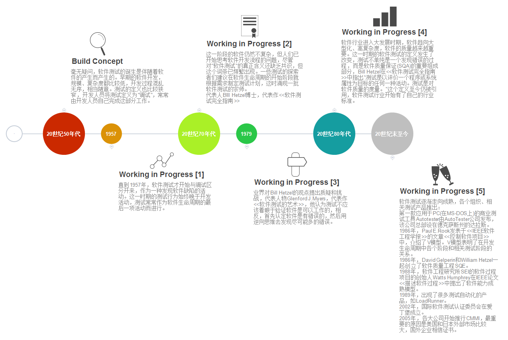

## 软件测试的定义

> 软件测试的定义可以归纳为: 软件测试是评价软件或系统是否符合预期要求、找出问题并对风险进行评估的过程。

### “世界上第一个BUG”
     
世界上第一个计算机“错误”出现在1947年。当时,哈佛大学的神经生理学家 生物物理学家霍华德·艾肯(Howard Aiken)在马克I计算机上发现第一个计算机“错误”。在运行一个计算 task 的时候,计算机突然停止工作,并且吐出一长串的诊断信息,其中包括一条警告信息,指出内存地址245处出现错误。这是人类有记录的第一个计算机程序错误信息。

而软件行业公认的第一个“Bug”出现在1947年9月9日。当时,宾夕法尼亚大学的计算机工程师格雷斯·霍普博士(Dr. Grace Hopper)在调试UNIVAC I 计算机的时候,发现其中的故障源头竟然是一只飞蛾!这只飞蛾飞入了计算机内引发了故障,霍普博士将其取出并粘贴在了日志本上,并在上面写道“First actual case of bug being found.”这就是最早软件Bug的由来,并被记录在案。

第一条计算机程序错误信息和第一只被发现的真正的软件Bug标志着软件测试产生的起源。从那时起,程序错误和软件缺陷的发现与修复过程,逐渐演变为软件测试这门专业技术和学科。随后,各种测试方法、理论、过程和实践也在发展, ultimate 形成了现代的软件测试体系。

所以,可以说世界上第一个BUG的发现描绘了软件测试产生的缘起,也是软件测试发展历史的一个有趣起点。这个轶事常被软件测试研究人员和从业人员故意提起,因为它让我们记住软件测试发展的起源与软件工程这门技术领域的成长轨迹。

谁是Grace Hopper？
是与“阿兰·图灵、史蒂夫·乔布斯、比尔·盖茨”等一同入选“IT界十大最有远见的人才”的唯一一位女性—Grace Hopper
她是耶鲁大学 233 年校史上的首位数学女博士。毕业后霍普参与了美军研究项目，主要研究一种用来计算火箭的自动顺序控制计算机。

- 设计世界上第一个编译程序A—O
- 主导研制出第一个商用编程语言COBOL，被称为“COBOL 之母”
- 美国历史上第一位女性少将
- 1980年，获得国际IEEE组织颁发的首届计算机先驱奖。

### 软件测试技术的发展历程

- 软件测试的发展历程可以分为以下几个阶段：

1. 调试导向时期(1950-1960年代): 软件测试最初由程序员完成,主要目的是调试程序和修复代码缺陷。测试活动与开发同步进行,测试工具和方法很初级。
2. 标准化时期(1970年代): 开始重视测试的系统性和标准化,提出定量的测试流程和测试用例设计方法。出现第一代专业测试工具,测试逐渐脱离开发独立出来。
3. 质量保证时期(1980年代): 测试的主要目标变成保证软件产品质量。出现更加成熟的测试理论、测试管理思想和测试自动化工具。测试被正式独立出来成为产品发布的质量把关环节。
4. 缺陷管理时期(1990年代): 开始重视测试的缺陷管理,使用缺陷跟踪系统来管理测试过程中发现的各种缺陷,及时反馈给开发人员。出现更加强大的测试管理平台和测试自动化框架。
5. 风险导向时期(21世纪至今): 测试的主要目标变成识别和减少产品及项目风险。提出了基于风险的测试理论和方法,测试被项目风险管理全过程所引导,并贯穿软件生命周期。现代化的测试工具和测试服务日益成熟。

6. 综上,软件测试随时代发展和技术变革不断演进。从最初的调试测试,到现代的风险导向测试以及持续测试,软件测试逐渐向着更加成熟和体系化的方向发展。测试理念、方法、工具和组织不断改进,为软件工程技术的进步提供有力支撑。
软件测试发展的主线是:调试测试→标准化测试→质量保证测试→缺陷管理测试→风险导向测试,这是软件测试发展的必然趋势。

发展历程图：

### 软件测试的未来发展

1. 自动化测试日益普及:

    测试自动化是未来发展的必然趋势,各种测试工具和框架会日趋成熟,自动化测试会渗透到更多测试类型和阶段。
    
    例如:
    - 单元测试和接口测试的自动化会进一步提高
    - 自动化移动测试和安全测试会加快推进 
    - 测试管理平台会提供更丰富的自动化测试报告和追踪功能
    - 云测试平台的兴起降低自动化测试门槛,使更多中小团队可以使用自动化测试

2. 持续测试全面推行:

    持续集成和持续交付理念的普及会推动持续测试的全面实施,使质量管理贯穿整个软件生命周期。

    例如:
    - 持续测试工具和服务会更加成熟,可以更好支持持续集成和持续交付 
    - 持续测试覆盖率和频次会进一步提高 
    - 持续性能测试和安全测试会更加重要

3. 基于人工智能的测试进一步发展:

    人工智能技术的进步为软件测试带来新的机遇与挑战,基于机器学习、深度学习等技术的测试工具会进一步成熟和普及。   
    例如:
    - 基于机器学习的自动化测试用例生成工具可能大规模推出 
    - 智能测试工具可以通过分析大量历史测试数据识别新测试场景 
    - 人工智能可能在一定程度上替代人工测试设计与执行测试用例 
    - 测试报告与缺陷预测可能由人工智能完成 
    - 软件测试相关的人工智能云服务会逐渐推出 

---
科技发展的现在，软件测试已经行走了数十年，但是国内的行业发展速度仍然没有国外的完善，我们引入了许多的完备的流程来看护质量，在日益进步的今天，基于人工智能的测试发展已经走到了我们的面前，作为一位在这个行业耕耘了多年的打工人，职业上的发展就是想走在世界的前沿，探索无人区，通过增强自己的技术手段，扩展技术栈，在领域上有更大的影响力，要为测试发声！我们才是最棒的！！！

- 人工智能算法测试需要具备的能力：

    1. 具备阅读代码的能力
    2. 具备一定的数学能力
    3. 严谨的思维和不屈的意志(bushi

- 一位算法测试小白的自我培养

    接下来我会穿插测试计划、技术栈、先进技术探索，在我的blog下。