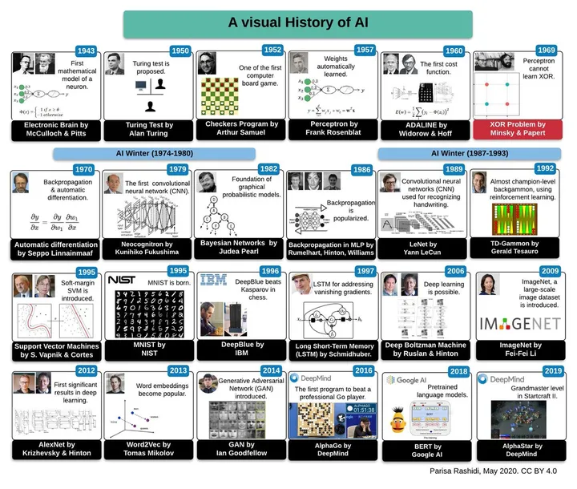
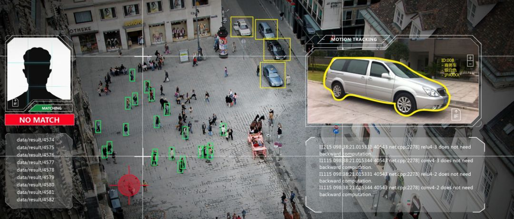
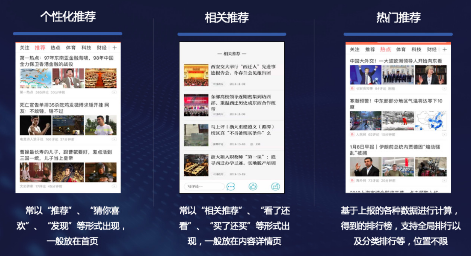
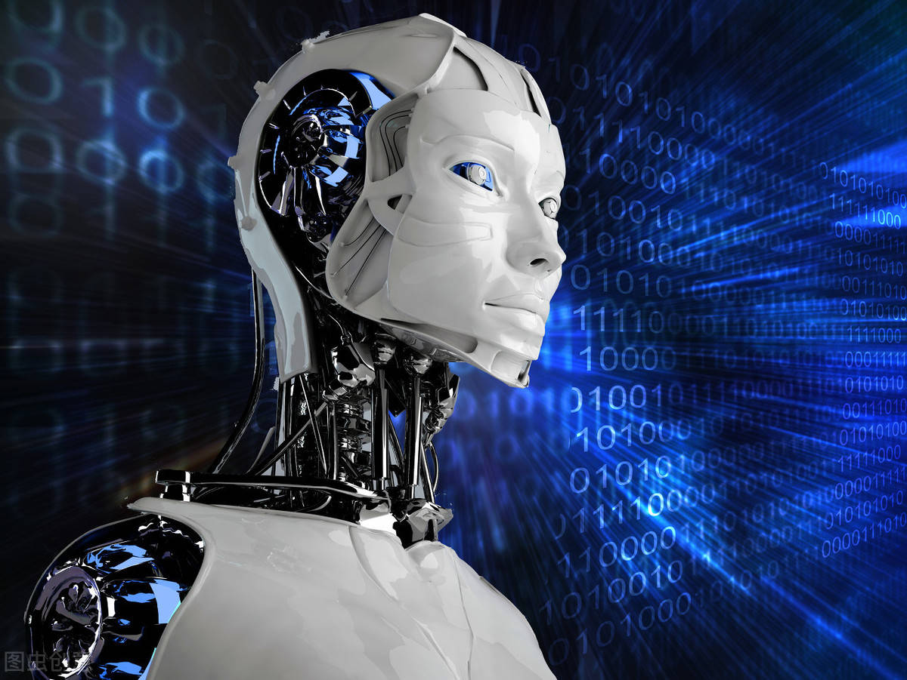

## 人工智能的出现（AI）

> 2023年被誉为人工智能AI时代开启的元年，OPEN AI发布的ChatGPT席卷全球，敲响AIGC时代元年的钟声，各大AI公司争先恐后在AI上进行布局，Google的Bard,百度的文心一言,阿里的通义千问,讯飞的星火认知,Midjourney,Stable diffusion,AutoGPT等技术层出不穷，在2023的春天如雨后春笋般崭露头角，极大的冲击当前的社会生产，提高的生产效率，为很多行业带来了翻天覆地的改变，所以在这个沐浴着AI的时代，我们要知道AI能为我们做什么，AI能怎么改善我们的生活，AI是一把双刃剑，带来了高效的生产效率，也带来认知危机，伦理安全问题也开始渐渐浮出水面：如果AI有了意识，对人类不利？，接下来我将对AI的基础知识进行一些总结，往后会继续更迭，将更大AI技术剖析分解(进行信息整合和收集)

### 人工智能来到世界的脚印

1. 1997年,Deep Blue击败卡斯帕罗夫成为国际象棋世界冠军。这是人工智能首次在复杂的游戏领域战胜人类,产生了巨大影响。

2. 2011年,IBM的Watson在美国电视节目《全美超级计算机》中战胜人类选手,夺得冠军。这展示了人工智能在复杂语言理解与问答上的能力。

3. 2016年,DeepMind的AlphaGo击败了围棋高手李世乭,在百战百胜的围棋游戏中战胜人类。这是人工智能在难度更大的棋类游戏的重大胜利。

4. 2018年,Anthropic研发的AI系统“贝浩特”通过Reddit对话测试,部分审核者将其误认为人类。这意味着人工智能的对话能力已接近人类水平。

5. 2020年,DeepMind的AlphaFold在蛋白质折叠方面超越人类专家,揭示出一系列蛋白质的3D结构。这预示着人工智能在生物学领域的重大应用潜力。

6. 2020年,OpenAI开发的GPT-3在11项语言理解任务中战胜人类专业语言学家。这表明人工智能的自然语言处理技术已达到里程碑式的进步

7. 2021年,百度的Deep Voice推出首个通过教师彻底培训的AI新闻播音员。这标志着人工智能开始在更广泛领域替代人工,引发了广泛社会讨论。

8. 2022年，OPEN-AI ChatGpt推出v3.0版本，生成式AI(人工智能)取得突破性进展，出现的AI绘画和ChatGTP的重要性不亚于2016年AlphaGo战胜人类围棋冠军的价值，ChatGPT是一款近期火爆全球的聊天机器人，它能直接生成代码，会自动修复bug，还能写诗，聊各种话题，由OpenAI公司推出。大模型时代产生的作用让各大头部AI厂商纷纷追投，加入AIGC的战场，一场AI的科技军备竞赛悄然降临

9. 2023年，OPEN-AI推出了4.0相比与3.0，该版本的大模型能够支持图片输入，给一张手绘草稿图AI就能替你生产一个网页的代码，其创作能力进一步提生，生产效率大幅提升，同期加入的Midjourney、Stable diffusion均表现出不俗的魅力，一时之间AI的热度再次掀起热浪，不就在ChatGpt之上更是出现了令人惊奇的AutoGPT，AutoGPT最大的特点就在于能全自动地根据任务指令进行分析和执行，自己给自己提问并进行回答，中间环节不需要用户参与，更进一步的释放了人类的双手

### 人工智能在现实生活的应用

1. 图像识别。许多手机和电脑 now 具备图像识别功能,可以自动分类和搜索图片。公司利用这项技术实现商品追踪和客户体验提高。医学界利用 AI 对 CT 和 X 光片进行快速诊断。

2. 语音助手。像苹果的Siri、亚马逊的Alexa、谷歌的Assistant等,已经为我们提供了方便的语音交互体验。这些AI助手可以通过语音指令控制各种设备,回答各类问题等。

3. 机器翻译。Google 翻译、百度翻译等翻译工具依靠人工智能实现各国语言之间的翻译。这极大地促进了人们的交流与理解。

4. 推荐系统。电商网站和视频平台会根据用户的浏览和消费记录,利用人工智能推荐新的商品或内容。这些推荐显著提高了用户体验,也为企业创造了更高的转化率。

5. 自动驾驶。特斯拉、谷歌等公司正在研发自动驾驶技术,目标是实现车辆完全的自主驾驶。这将极大改变未来的交通状况与方式。

6. 机器人。许多机器人已用于生产装配线和仓储物流中,取代人工完成搬运、搬运等重复性工作。教育和服务业也在尝试机器人的应用,如代课机器人和服务机器人等。

7. 智能医疗。人工智能可以辅助医生进行诊断、治疗决策和手术执行。各大技术公司都在研发相关产品,以实现更精准和深入的医疗服务。

### 人工智能未来的发展和不利影响

>人工智能AI是人类社会的一把双刃剑，能够提高生产效率，释放人力，但是同样也带来了一些社会影响，正确使用好它是我们每一个人类应尽的义务，对于未来的AI我还是保持乐观的状态，相信未来的赛博朋克会一步一步到来，对世界抱有信心吧，我们的生活会越来越好

- 发展

    1. 技术突破:计算机算力持续增强,算法不断进步,这将助力人工智能在视觉、语言、推理等领域达到新的高度。5G等新技术也为其应用创造条件。

    2. 数据积累:人工智能需要大量数据进行训练与优化,未来数据量会进一步激增,这为人工智能的进步提供宝贵的资源。

    3. 融合发展:人工智能与其他前沿技术融合发展,如物联网、区块链、生物技术等,将孕育出更多创新应用和商业模式。

    4. 商业落地:越来越多企业投入人工智能,各行各业纷纷采用人工智能技术改造业务流程与模式,这将产生较大的经济效益与社会效用

- 不利影响
    1. 安全与偏见:如何提高人工智能的可解释性与公平性,避免偏差与失误,是一大难题。人工智能也面临潜在的恶意利用,威胁网络与信息安全。

    2. 伦理与法律:人工智能在应用推广过程中,不可避免地涉及伦理与法律问题,如数据隐私保护、知识产权及刑事责任界定等,这需要各界共同努力研究与准备。

    3. 就业影响:人工智能可能导致部分工作岗位消失或性质改变,会对就业与经济产生较大冲击。我们需要提前应对,采取行动尽可能减轻这些影响。

    4. 不足与差异:人工智能研发水平在全球范围内存在较大差异,相关政策、标准与规范也不统一,制约着人工智能在全球范围的有序发展,这需要加强国际合作与沟通。

    5. "人工智能冬天":如果人工智能发展遇到长期瓶颈,无法继续取得突破,企业与投资者可能会对其冷淡,导致研发资源下滑,阻碍其健康发展。我们需要为此做好准备,以持续推动人工智能向前发展。

### 写在最后

>要熟悉和了解人工智能AI，正确的使用AI，需要我们对其有一定的认知和了解，接下来的时间，我会根据所接触和使用的技术，对人工智能的技术开始学习，并以blog的方式展现出来，敬请关注

下面列一下参考学习的书籍和网站:

1. [【吴恩达亲授】适用于所有人的人工智能课程（中字）](https://www.bilibili.com/video/av95146045/)

2. [【吴恩达教授】一个半小时学会 ChatGPT Prompt 工程](https://www.deeplearning.ai/short-courses/chatgpt-prompt-engineering-for-developers/)

3. 《人工智能简史》 by 史蒂芬·霍金,这是一本人工智能发展历史的概述,由世界知名科学家史蒂芬·霍金编著,内容浅显易懂,很适合新人入门。

4. 《生而智能:人工智能是什么,为什么如此重要》 by 杰夫·霍金,这本书由人工智能专家杰夫·霍金编写,它详细而系统地解释了什么是人工智能,其重要性及面临的机遇与挑战,是一本权威且全面地介绍人工智能的教材。

5. 《机器学习》by 周志华,这是一本机器学习领域的经典教材,作者周志华是这方面的专家,书中详细介绍了机器学习的数学基础、算法与应用等,对于理解人工智能与机器学习至关重要。

6. 《深度学习》by 伊恩·古德费ロ,这是一本深度学习领域的权威教材,作者伊恩是深度学习的先驱与权威专家。这本书系统和全面地介绍了深度学习的理论、算法与应用,是学习人工智能与深度学习必读书籍。

7. 《TensorFlow 实战Google深度学习框架》by 黄海广,这是一本基于谷歌开源深度学习框架TensorFlow的实战教程,书中详细介绍了如何利用TensorFlow来开发人工智能应用,帮助读者快速掌握TensorFlow的机器学习技能,非常适合新手入门实践。

---
不积跬步, 无以至千里

学无止境，苦海无涯

加油吧，当你还是少年

一名进入人工智能领域小白学习总结

Allen.hu

2023/04/28
